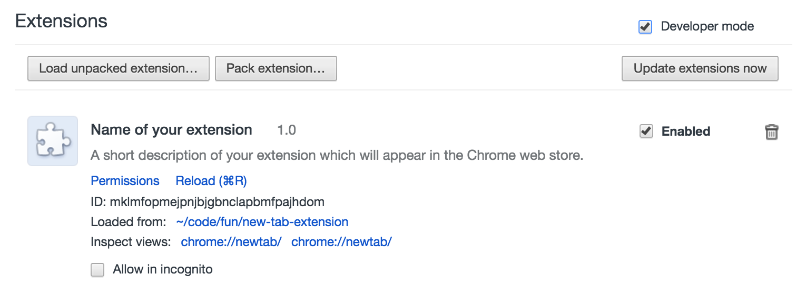

# Lab 2 Chrome Extension

Assignment Due Oct 14 by 11:30 PM.

The purpose of this assignment is to help you get started with vanilla JS development.

Using the scaffold in this repo and [Figma materials](https://www.figma.com/file/UIfuD6GDuIb15kDO4aRQdF/Lab2-Chrome-Extension), create an in-browser todo application that should be a "new tab" extension for Chrome. Please, use flexbox for html layout. Do not use frameworks, just vanilla js. Pre or post processors for styles are ok.

By the deadline, you should have your code in the repo and demo video on how the app works.

You will be graded based on the following criterias:

1. Todo list along with gauge is implemented according to the design provided with an ability to add a new task and mark it completed. Tasks are persisted in local storage and saved between page refreshes. (+6 points)
2. Remove items feature is implemented. (+1 point)
3. Scroll is handled properly. Scroll bar custom styles are used. (+1 point)
4. Empty state screens are implemented (all done and/or nothing planned). (+2 points)
5. Start new day feature is implemented (with ability to move some tasks on a new day). (+2 points)

## How to run an extension in developer mode

In order to develop an extension you need to run it in "Developer mode". Here are the steps to do that...

1. Check out the repo.
2. Open Google Chrome.
3. Go to the **Extensions** page. Here are some ways to get there:
    * Type `chrome://extensions` into the URL bar and hit enter (where you'd usually type things like "www.google.com").
    * Go to **Window** and then select **Extensions**.
    * Click the icon with three dots in the upper right corner of Chrome. Then hover on **More Tools** and then select **Extensions**.
4. When you're in Extensions, click the checkbox labeled **Developer mode**. (It's at the top right corner of the list of extensions).
5. When developer mode is enabled, you should see some new buttons appear. Click the **Load unpacked extension...** button. ("Unpacked" simply means that it hasn't been zipped up because you're still working on it. When you publish your extension to the Chrome store, you need to zip it up, but don't worry about that yet.)
6. Find and select your project folder on your computer.
    * If it's running correctly, you should see something like this.
    
    * If there's an error, you'll see a yellow box appear that will tell you what's wrong.

7. Open a new tab, and see the extension running! Now when you make changes, you can refresh the page and see your changes.

## Hints

* For persistence you will need [Local storage api](https://developer.mozilla.org/en-US/docs/Web/API/Window/localStorage)
* How to deal with SVG in HTML (how to style svg from css in the end of the article) [svg in html](https://htmlacademy.ru/blog/boost/graphics/short-4)
* To name css classes properly [BEM](https://ru.bem.info/methodology/quick-start/)
* How to style scrollbar [styling scrollbars](https://css-tricks.com/the-current-state-of-styling-scrollbars/)
* Pseudo classes for hovered and focused states [css pseudo classes](https://marksheet.io/css-pseudo-classes.html)
* CCS transitions to make appearing/disappearing of elements smoother [transitions](https://developer.mozilla.org/en-US/docs/Web/CSS/transition)
* Two modes of how total width and height of an element is calculated (helpful to deal with picked state of todo item) [box-sizing](https://developer.mozilla.org/en-US/docs/Web/CSS/box-sizing)
* To place «new day» button in the left-bottom corner it’s convenient to use position absolute [position](http://htmlbook.ru/css/position)
